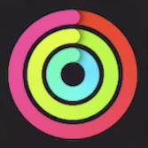
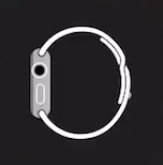
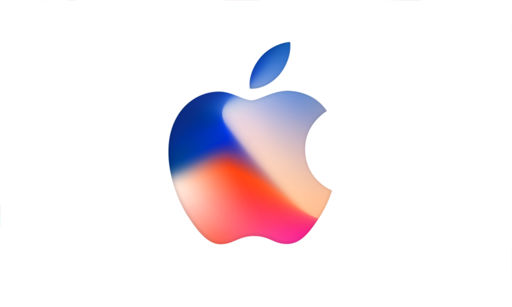
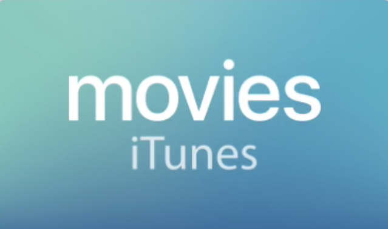
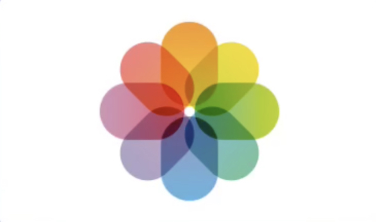
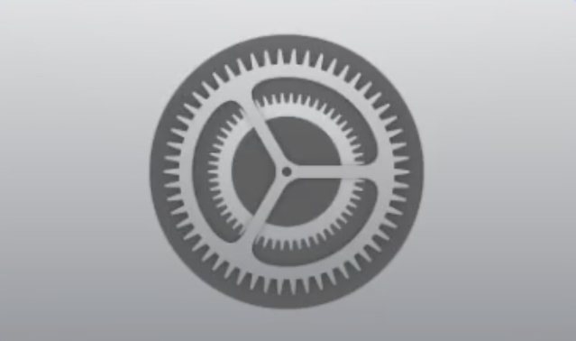
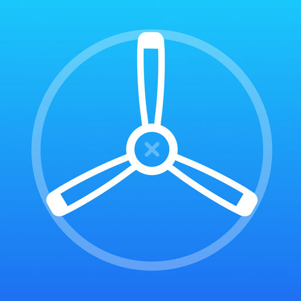
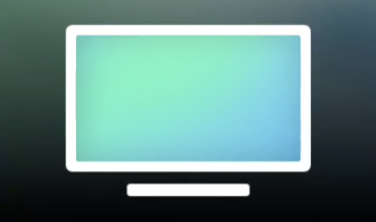

  

  
  

| Icon | App Name | Bundle ID | iPhone | iPad | tvOS | Built-in | App Store |
| ------ | ------ | ------ | :------: | :------: | :------: | :------: | :------: |
|  | Activity | com.apple.Fitness | :white_check_mark: |  |  | :white_check_mark: |  |
|  | AirPort Utility | com.apple.airport.mobileairportutility | :white_check_mark: | :white_check_mark: |  |  | :white_check_mark: |
|  | App Store | com.apple.AppStore | :white_check_mark: | :white_check_mark: |  | :white_check_mark: |  |
|  | Apple Classroom | com.apple.classroom |  | :white_check_mark: |  |  | :white_check_mark: |
|  | Apple Heart Study | com.apple.Antimony | :white_check_mark: |  |  |  | :white_check_mark: |
|  | Apple Music | com.apple.Music | :white_check_mark: | :white_check_mark: |  | :white_check_mark: |  |
|  | Apple News | com.apple.news | :white_check_mark: | :white_check_mark: |  | :white_check_mark: |  |
|  | Apple Store | com.apple.store.Jolly | :white_check_mark: | :white_check_mark: |  |  | :white_check_mark: |
|  | Apple Support | com.apple.supportapp | :white_check_mark: | :white_check_mark: |  |  | :white_check_mark: |
|  | Apple TV | com.apple.tv | :white_check_mark: | :white_check_mark: |  | :white_check_mark: |  |
|  | Apple TV Remote | com.apple.TVRemote | :white_check_mark: | :white_check_mark: |  |  | :white_check_mark: |
|  | Calculator | com.apple.calculator | :white_check_mark: |  |  | :white_check_mark: |  |
|  | Calendar | com.apple.mobilecal | :white_check_mark: | :white_check_mark: |  | :white_check_mark: |  |
|  | Camera | com.apple.camera | :white_check_mark: | :white_check_mark: |  | :white_check_mark: |  |
|  | Clips | com.apple.clips | :white_check_mark: | :white_check_mark: |  |  | :white_check_mark: |
|  | Clock | com.apple.mobiletimer | :white_check_mark: | :white_check_mark: |  | :white_check_mark: |  |
|  | Compass | com.apple.compass | :white_check_mark: |  |  | :white_check_mark: |  |
|  | Contacts | com.apple.MobileAddressBook | :white_check_mark: | :white_check_mark: |  | :white_check_mark: |  |
|  | FaceTime | com.apple.facetime | :white_check_mark: | :white_check_mark: |  | :white_check_mark: |  |
|  | Feedback Assistant | com.apple.appleseed.FeedbackAssistant | :white_check_mark: | :white_check_mark: |  |  |  |
|  | Files | com.apple.DocumentsApp | :white_check_mark: | :white_check_mark: |  | :white_check_mark: |  |
|  | Find iPhone | com.apple.mobileme.fmip1 | :white_check_mark: | :white_check_mark: |  | :white_check_mark: |  |
|  | Find My Friends | com.apple.mobileme.fmf1 | :white_check_mark: | :white_check_mark: |  | :white_check_mark: |  |
|  | Game Center | com.apple.gamecenter |  |  |  |  |  |
|  | GarageBand | com.apple.mobilegarageband | :white_check_mark: | :white_check_mark: |  |  | :white_check_mark: |
|  | Health | com.apple.Health |  |  |  | :white_check_mark: |  |
|  | Home | com.apple.Home | :white_check_mark: | :white_check_mark: |  | :white_check_mark: |  |
|  | iBooks | com.apple.iBooks | :white_check_mark: | :white_check_mark: |  | :white_check_mark: |  |
|  | iCloud Drive | com.apple.iCloudDriveApp |  |  |  |  |  |
|  | iMovie | com.apple.iMovie | :white_check_mark: | :white_check_mark: |  |  | :white_check_mark: |
|  | iTunes Connect | com.apple.itunesconnect.mobile |  |  |  |  | :white_check_mark: |
|  | iTunes Remote | com.apple.Remote | :white_check_mark: | :white_check_mark: |  |  | :white_check_mark: |
|  | iTunes Store | com.apple.MobileStore | :white_check_mark: | :white_check_mark: |  | :white_check_mark: |  |
|  | iTunes U | com.apple.itunesu |  | :white_check_mark: |  |  | :white_check_mark: |
|  | Keynote | com.apple.Keynote | :white_check_mark: | :white_check_mark: |  |  | :white_check_mark: |
|  | Logic Remote | com.apple.musicapps.remote | :white_check_mark: | :white_check_mark: |  |  | :white_check_mark: |
|  | Mail | com.apple.mobilemail | :white_check_mark: | :white_check_mark: |  | :white_check_mark: |  |
|  | Maps | com.apple.Maps | :white_check_mark: | :white_check_mark: |  | :white_check_mark: |  |
|  | Messages | com.apple.MobileSMS | :white_check_mark: | :white_check_mark: |  | :white_check_mark: |  |
|  | Music Memos | com.apple.musicmemos | :white_check_mark: | :white_check_mark: |  |  | :white_check_mark: |
|  | Notes | com.apple.mobilenotes | :white_check_mark: | :white_check_mark: |  | :white_check_mark: |  |
|  | Numbers | com.apple.Numbers | :white_check_mark: | :white_check_mark: |  |  | :white_check_mark: |
|  | Pages | com.apple.Pages | :white_check_mark: | :white_check_mark: |  |  | :white_check_mark: |
|  | Phone | com.apple.mobilephone | :white_check_mark: |  |  | :white_check_mark: |  |
|  | Photo Booth | com.apple.Photo-Booth |  | :white_check_mark: |  | :white_check_mark: |  |
|  | Photos | com.apple.mobileslideshow | :white_check_mark: | :white_check_mark: |  | :white_check_mark: |  |
|  | Reminders | com.apple.reminders | :white_check_mark: | :white_check_mark: |  | :white_check_mark: |  |
|  | Safari | com.apple.mobilesafari | :white_check_mark: | :white_check_mark: |  | :white_check_mark: |  |
|  | Schoolwork | com.apple.schoolwork.ClassKitApp
| :white_check_mark: |  |  | :white_check_mark: |
|  | Settings | com.apple.Preferences | :white_check_mark: | :white_check_mark: |  | :white_check_mark: |  |
|  | Stocks | com.apple.Stocks | :white_check_mark: |  |  | :white_check_mark: |  |
|  | Swift Playgrounds | com.apple.Playgrounds |  | :white_check_mark: |  |  | :white_check_mark: |
|  | Tips | com.apple.tips | :white_check_mark: | :white_check_mark: |  | :white_check_mark: |  |
|  | Videos | com.apple.videos | :white_check_mark: | :white_check_mark: |  | :white_check_mark: |  |
|  | Voice Memos | com.apple.VoiceMemos | :white_check_mark: |  |  | :white_check_mark: |  |
|  | Wallet | com.apple.Passbook | :white_check_mark: |  |  | :white_check_mark: |  |
|  | Watch | com.apple.Bridge | :white_check_mark: |  |  | :white_check_mark: |  |
|  | Weather | com.apple.weather | :white_check_mark: |  |  | :white_check_mark: |  |
|  | Web Clips | com.apple.webapp | :white_check_mark: | :white_check_mark: |  |  |  |
|  | Workflow | is.workflow.my.app | :white_check_mark: | :white_check_mark: |  |  | :white_check_mark: |
|  | App Store (tvOS) | com.apple.TVAppStore |  |  | :white_check_mark: | :white_check_mark: |  |
|  | Apple Events | com.apple.appleevents |  |  | :white_check_mark: |  | :white_check_mark: |
|  | Computers (tvOS) | com.apple.TVHomeSharing |  |  | :white_check_mark: | :white_check_mark: |  |
|  | iBooks StoryTime | com.apple.TVBooks |  |  | :white_check_mark: |  | :white_check_mark: |
|  | iMovie Theater | com.apple.iMovieTheatre |  |  | :white_check_mark: |  | :white_check_mark: |
|  | iTunes Movie Trailers | com.apple.movietrailers | :white_check_mark: | :white_check_mark: | :white_check_mark: |  | :white_check_mark: |
|  | Movies (tvOS) | com.apple.TVMovies |  |  | :white_check_mark: | :white_check_mark: |  |
|  | Music (tvOS) | com.apple.TVMusic |  |  | :white_check_mark: | :white_check_mark: |  |
|  | Photos (tvOS) | com.apple.TVPhotos |  |  | :white_check_mark: | :white_check_mark: |  |
|  | Podcasts | com.apple.podcasts | :white_check_mark: | :white_check_mark: | :white_check_mark: | :white_check_mark: |  |
|  | Search (tvOS) | com.apple.TVsearch |  |  | :white_check_mark: | :white_check_mark: |  |
|  | Settings (tvOS) | com.apple.TVSettings |  |  | :white_check_mark: | :white_check_mark: |  |
|  | TestFlight | com.apple.TestFlight | :white_check_mark: | :white_check_mark: | :white_check_mark: |  | :white_check_mark: |
|  | TV (tvOS) | com.apple.TVWatchList |  |  | :white_check_mark: | :white_check_mark: |  |
|  | TV Shows (tvOS) | com.apple.TVShows |  |  | :white_check_mark: | :white_check_mark: |  |
|  | WWDC | developer.apple.wwdc-Release | :white_check_mark: | :white_check_mark: | :white_check_mark: |  | :white_check_mark: |

